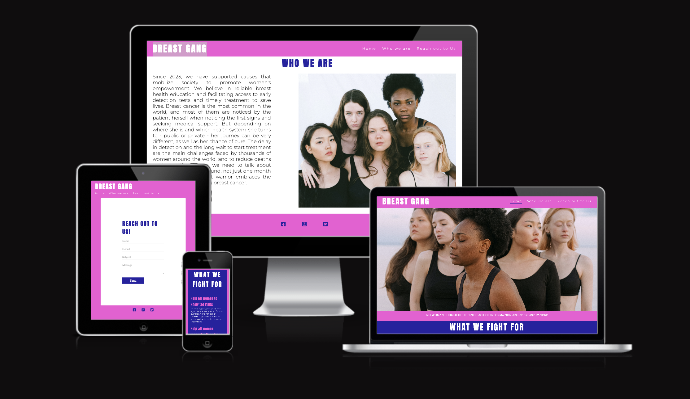
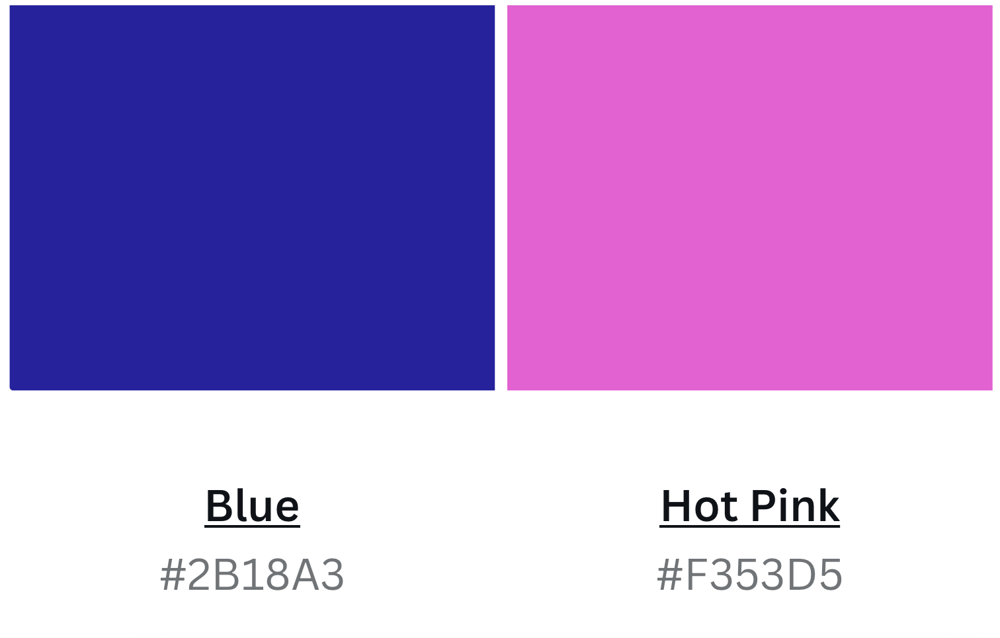

# BREAST GANG 🤍

## Purpose

Breast Gang is a website containing information trying to spread awareness about breast cancer all year. Because a health issue doesn’t need only one month in the year to discuss about it.

### Target:

This site is target at women's who is dealing with breast cancer, who already had and to make all women aware of breast cancer.

### User goals:

1. Web page is easily accessible through search engine.
2. The navigation bars are clearly visible.
3. The reach out to us form is large enough.

--------------------
## Design

My choice of colors was to bring impact as soon as the user accesses the site and to bring an image of recognition for future campaigns.

### Color Scheme:

The palette was defined trough search on the [Canva Color Palette](https://www.canva.com/colors/color-palettes/) 

### Typography: 

For the name Breast Gang the font was used with the Anton font, for the main text through the website Montserrat was used with a fallback to Sans Serif.

--------------------
## Technologies Used

* HTML
  * This project uses HTML to structure the website.

* CSS
  * This project uses CSS to style the website.

* Google Fonts
  * This projects uses [Google Fonts](https://fonts.google.com/)
    * Anton
    * Lora
    * Montserrat

* Font Awesome
  * This project uses [Font Awesome](https://fontawesome.com/) for icons.

* GitHub Pages
  * This project uses GitHub pages to host the website.

* Pexels
  * This project uses [Pexels](https://www.pexels.com/) for images

* Instituto Avon 
  * This project uses [Instituto Avon](https://institutoavon.org.br) for research.

---------------------
## Validator Testing

### HTML

No errors were returned when passing through the official W3C validator.

### CSS

Two errors were found when passing through the official (Jigsaw) validator.

### Lighthouse