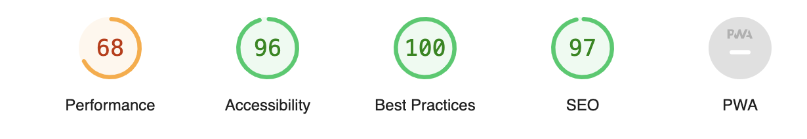

# BREAST GANG 🤍

## Purpose

Breast Gang is a website containing information trying to spread awareness about breast cancer all year. Because a health issue doesn’t need only one month in the year to discuss about it.

### Target:

This site is target at women's who is dealing with breast cancer, who already had and to make all women aware of breast cancer.

### User goals:

1. Web page is easily accessible through search engine.
2. The navigation bars are clearly visible.
3. The reach out to us form is large enough.

--------------------
## Design

My choice of colors was to bring impact as soon as the user accesses the site and to bring an image of recognition for future campaigns.

### Color Scheme:

The palette was defined trough search on the [Canva Color Palette](https://www.canva.com/colors/color-palettes/) 

### Typography: 

For the name Breast Gang the font was used with the Anton font, for the main text through the website Montserrat was used with a fallback to Sans Serif.

--------------------
## Technologies Used

* HTML
  * This project uses HTML to structure the website.

* CSS
  * This project uses CSS to style the website.

* Google Fonts
  * This projects uses [Google Fonts](https://fonts.google.com/)
    * Anton
    * Lora
    * Montserrat

* Font Awesome
  * This project uses [Font Awesome](https://fontawesome.com/) for icons.

* GitHub Pages
  * This project uses GitHub pages to host the website.

* Pexels
  * This project uses [Pexels](https://www.pexels.com/) for images

* Instituto Avon 
  * This project uses [Instituto Avon](https://institutoavon.org.br) for research.

---------------------
## Validator Testing

### HTML

No errors were returned when passing through the official W3C validator.

### CSS

Two errors were found when passing through the official (Jigsaw) validator.

### Lighthouse

I didn't reach the expected result, but I understand that the choice of colors and responsiveness affected the final result.

### Unfixed Bugs

I believe that due to lack of skill and understanding I was unable to resolve the bugs found even though I made the requested changes.

In the future I intend to focus more on the responsiveness of the site and its functionalities.

-------------------------
## Deployment

### Remote Deployment
* The site was deployed to GitHub pages. The steps to deploy are as follows:
  1. In the GitHub repository, navigate to the Settings tab
  2. On the left side menu, on the section Code and automation, click on Pages.
  3. From the source section drop-down menu, select the Deploy from a branch.
  4. From the branch section drop-down menu, select main, right on the side select /root.
  5. Once the the branch menus have been selected, github will create the page. It might take a few minutes. Once it is done a link will show up on the top of the page.

The live link can be found here - [Breast Gang](https://github.com/maiharamoni/breastgang)

### Clone/Forking
* To fork this site go to its GitHub repository [Breast Gang](https://github.com/maiharamoni/breastgang)
  1. On the top right of the page there's a button with the option Fork, click on it.
  2. A new page "Create a new fork" will open. If you wish, you can edit the name.
  3. In the end of the page click on the button "Create fork".
  4. Now you have a copy of the project on your repositories.

### Local Deployment
* This site was developed using Gitpod. To edit your copy on Gitpod you will need to:
  1. On your browser of choice install the gitpod extension/add-on.
  2. On GitHub open the project repository you forked before.
  3. On the top of the page, over the files, there is a green button on the right side of the page saying "Gitpod". Click it.
  4. It will open the Gitpod website. On the first time, you will select to connect with your GitHub account and Authorize gitpod-io. 
  5. After that you'll be creating an account.
  6. It might take a while after that because gitpod will be creating your workspace.
  7. After the workspace is loaded, you're able to edit it on Gitpod.

-----------------------
### Acknowledgement

I would like to thank my Mentor Martina for the support, patience and feedback.

And a special thanks to my colleagues from Slack.

--

Mai Haramoni.